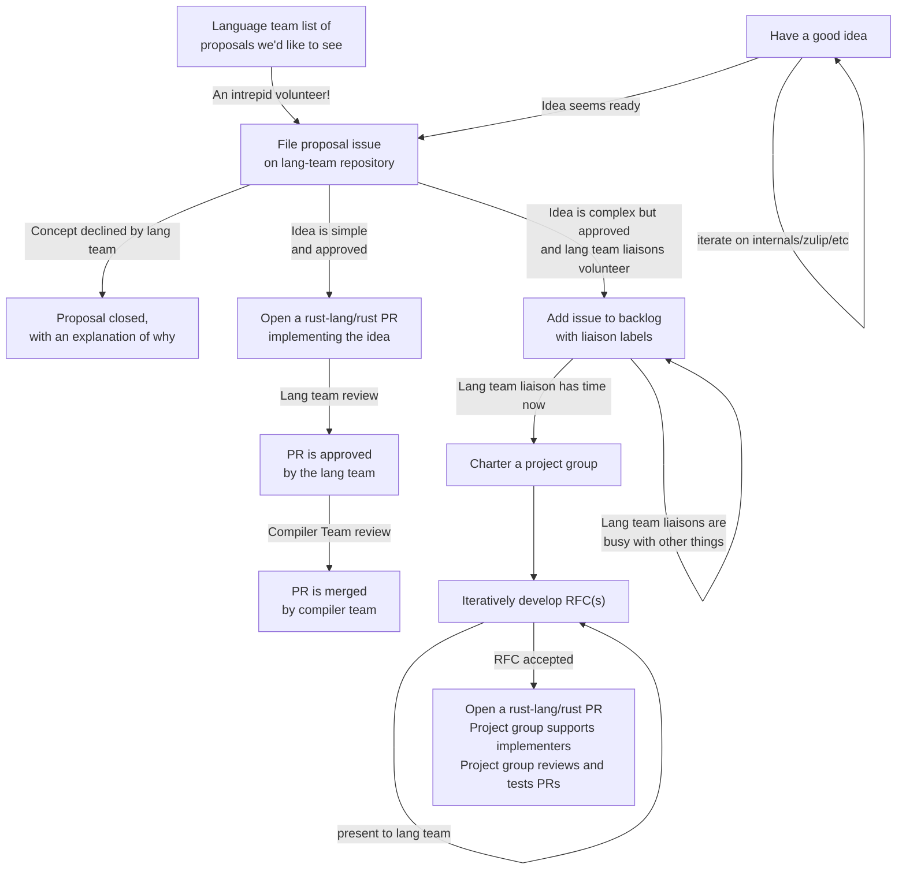

- Feature Name: (fill me in with a unique ident, `my_awesome_feature`)
- Start Date: (fill me in with today's date, YYYY-MM-DD)
- RFC PR: [rust-lang/rfcs#0000](https://github.com/rust-lang/rfcs/pull/0000)
- Rust Issue: [rust-lang/rust#0000](https://github.com/rust-lang/rust/issues/0000)

# Summary
[summary]: #summary

* Introduce a new step, the **proposal**, that is taken before an RFC is created. 
    * **Proposals** are created by opening a pull request on the lang-team repository, and they are designed to be relatively short and easy to write, with a focus on motivation and a de-emphasis on the details of the solution.
  * A Zulip topic is also created to discuss the proposal.
* If somebody in the lang team likes the proposal and has available bandwidth, they will opt to serve as a **liaison**. The liaison will work with you to see the proposal move forward.
  * Depending on their scope, a proposal may go forward in one of two ways:
    * For small changes, simply create a PR.
    * For larger changes that require an RFC -- or even multiple RFCs -- create a
      [project group] to jointly work on drafting it.
* To help in tracking what the lang-team is up to, as well as the set of bandwidth available for each member, we will track (and make publicly visible)
  * Active project groups, grouped by liasion
  * Topics of interest that each member may wish to pursue
  * A "short list" of proposals that the liaison liked and would like to pursue, but only after some other projects in their queue have completed
* Finally, if there is no activity on a proposal for a fixed amount of time, then it will be merged into a directory of "draft proposals".
  * Proposals from this directory can be resurrected later if there are new ideas, or if there is a liaison who has available bandwidth.
* In some cases, we may opt to actively decline a proposal, in which case we will give an explanation for why we do not wish to take that direction or try to solve that problem.

In order to transition to this system:

* We will tag all existing lang-team RFCs as "needs proposal" and block the threads.
* We encourage authors of all RFCs to create proposals.
* Presuming we are happy with the new system, at some point we will announce a time when existing "needs proposal" RFCs will be closed (or merged as draft proposals).

[project group]: https://github.com/rust-lang/rfcs/pull/2856

# Motivation
[motivation]: #motivation

The RFC system is one of Rust's great strengths, but we have found over time that there are also some shortcomings. The hope is that the "proposal" process will allow us to better focus our energies and create a more collaborative environment. Some of the benefits we foresee are as follows.

## More collaboration throughout the design process

Many people have reported that they have ideas that they would like to pursue, but that they find the RFC process intimidating. For example, they may lack the detailed knowledge of Rust required to complete the drafting of the RFC. 

Under the proposal system, people are able to bring ideas at an early stage and get feedback. If the idea is something we'd like to see happen, then a group of people can gather to push the RFC through to completion. The lang-team liaison can provide suggestions and keep the rest of the lang-team updated, so that if there are concerns, they are raised early.

Furthermore, we hope that project groups will help to shift the focus and way that design iteration happens, so that contentious issues can be discussed and settled in the group. RFC threads will be shorter livers and used more to gather feedback and points of concern that can then be ironed out within the group and the greater team. (Note that, while a project group is driving the design, the team members are the ones making the ultimate decision.)

## More focus on RFCs that reflect current priorities

The RFC repository currently contains far too many RFCs for anyone to keep up with -- especially members of the lang-team. Some of these RFCs are unlikely to be accepted, either because the ideas are too early stage, or because they don't align well with the project's current goals. Other RFCs may be very solid indeed, but they can be lost in the noise. 

We expect that after this change, the only RFCs that will be open are those that have already seen iteration in a project group, with the aid of a project liaison and general approval of the team. This makes the RFC repository a good place to monitor for ideas that have traction.

Meanwhile, the lang-team proposals will still contain quite a mix of ideas. However, unlike the RFC repository, we do not intend to allow proposals to stay open indefinitely. Proposals that do not receive a liaison (or have active discussion) will be merged into a draft directory, possibly to be resurrected later (but, regardless, serving as "design notes" fur possible future reference).

## More staging of discussion

Building on the previous point, we believe that this new process will allow us to better separate the different "stages" of the design and implementation process:

* Early design -- a proposal, discussed on Zulip
* Design iteration -- takes places on Zulip and in dedicated meetings
* Polished designs -- brought to the RFC repository for feedback

## Swifter resolution of RFCs, with design iteration taking place in project groups

Because RFCs will be the end result of more discussion, we can expect to resolve them faster. If the discussion uncovers critical flaws or new considerations, the RFC may be withdrawn and edited, and a new RFC posted instead. This can also happen if there is simply a lot of feedback, even if the design doesn't change -- in those cases, the new RFC will be updated to include a summary of the major points as well as responses to them. When working on amended RFCs, we can focus the discussion on the oustanding questions and avoid rehashing oldr debates.

This should help with the problem that longer RFCs threads can be quite hard to follow. This is compounded by the fact that the RFC evolves over the course of the discussion, sometimes changing dramatically. Getting "up to speed" on the state of an RFC thread involves reading a mix of stale comments on older drafts that have long since been addressed, thoughts on motivation, details of the design, and other things, and trying to sort them into an order.

# Guide-level explanation
[guide-level-explanation]: #guide-level-explanation

Hello! If you would like propose a change to the Rust language, you've come to the right place. The process can be summarized as follows:

* Create a **lang-team proposal** -- this should summarize your motivations and sketch out some of the details of your idea. You don't have to have everything figured out at this stage, and it's more important to emphasize the problems you are solving and why they're important than the nitty gritty details of how to solve them.
    * When you create a proposal, we will also automatically make a Zulip stream for discussion.
* If the proposal is accepted, then a **lang team liaison** may opt to work with you.
    * If the proposal is simple enough, then the liaison may suggest you go straight to implementation. In this case, you can create a PR against the rust-lang repository.
    * Otherwise, we'll create a **project group** to start working on the design. This may first involve some amount of iteration on the design space and will eventually culminate in drafting one or more RFCs.
* Most proposals are not accepted. In that case, your proposal will be merged into a "draft proposals" directory. That can occur for a number of reasons:
    * There are no lang team members who have available bandwidth to serve as a liaison right now.
    * The problem being solved doesn't seem important enough or is not a match for Rust's current priorities.
    * The proposal has flaws in its design that don't seem like they can be solved.
* Whenever possible, we will try to comment on the proposal 

## Forming a project group

XXX -- let's talk a bit about procedure here, the drafting of a charter, and especially when we want to have an RFC and when we don't. I think that for some larger projects, such as inline assembly or embarking on something like async await, an RFC to "charter" the group feels potentially appropriate. Or at least I am concerned that we don't have a sufficiently "public" place to host discussion of that kind, if we stick solely to proposals on the lang-team repo and Zulip threads.

## Diagram

# Reference-level explanation
[reference-level-explanation]: #reference-level-explanation

## Template for lang-team proposals

We will create a template for lang-team proposals that has the following sections:

* Summary
    * a few bullet points to capture the high-level concept
* Motivation and use-cases
    * examples of the problem being solved and why we care
* Links and related work
    * links to internals threads, other languages, etc
* Solution sketches
    * sketch of one or more ways to solve the problem

## Automation

We will have a bot that monitors proposals for activity. The bot will take the following automated actions:

* When a PR is opened that creates a single file or root directory in the "draft proposals" directory, it will tag it as "draft proposal" and create a Zulip stream.
* Lang team members may write a `@rustbot liaison` command to indicate their willingness to serve as liaison.
* After N days in which no lang-team members have made comments on the proposal PR, the bot will post a comment, both on the proposal and on the Zulip stream, putting the proposal into FCP for automatic close due to inactivity.
* After the FCP expires, if no comment from a lang-team member has been made, the proposal is marked as "draft" and the comment thread is locked.
    * A human will briefly review the PR for inappropriate language or other such things and merge it.

# Drawbacks
[drawbacks]: #drawbacks

* More procedure
* 

# Rationale and alternatives
[rationale-and-alternatives]: #rationale-and-alternatives

* We could have proposals be opened on the RFC repository
    * Why? Central place for all proposals across teams.
    * Why not? The RFC repository is no longer a "high signal" place to watch for "changes that have traction".
* We could try this for all teams at once.
    * Why? Uniform process is good.
    * Why not? Not sure how it will work, and each team has somewhat different needs.

# Prior art
[prior-art]: #prior-art

* TC39 Champion Process
* ...?

# Unresolved questions
[unresolved-questions]: #unresolved-questions

- What parts of the design do you expect to resolve through the RFC process before this gets merged?
- What parts of the design do you expect to resolve through the implementation of this feature before stabilization?
- What related issues do you consider out of scope for this RFC that could be addressed in the future independently of the solution that comes out of this RFC?

# Future possibilities
[future-possibilities]: #future-possibilities

Think about what the natural extension and evolution of your proposal would
be and how it would affect the language and project as a whole in a holistic
way. Try to use this section as a tool to more fully consider all possible
interactions with the project and language in your proposal.
Also consider how the this all fits into the roadmap for the project
and of the relevant sub-team.

This is also a good place to "dump ideas", if they are out of scope for the
RFC you are writing but otherwise related.

If you have tried and cannot think of any future possibilities,
you may simply state that you cannot think of anything.

Note that having something written down in the future-possibilities section
is not a reason to accept the current or a future RFC; such notes should be
in the section on motivation or rationale in this or subsequent RFCs.
The section merely provides additional information.
